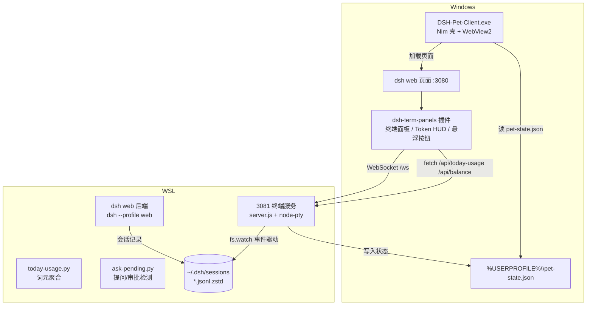

# DSH Pet Client v2.0

DeepSeek Harness 的 Windows 桌面客户端——托盘 + 悬浮鲸鱼宠物 + **内嵌终端** + **Token HUD**。

用 **Nim + webui + winim** 实现，双击运行即打开嵌入 WebView2 的 DSH 窗口。

> ⚠️ **重要：本版本要求 dsh web 部署在 WSL 中**（终端服务、词元统计、宠物状态联动均依赖 WSL 侧的配套服务），部署方式见下方「WSL 部署」。

## 亮点

| 指标 | 数值 |
|---|---|
| exe 体积 | ~900 KB |
| 内存占用 | ~27 MB |
| 启动 | 秒开（WebView2 初始化除外）|
| 渲染内核 | WebView2（Windows 自带，无需打包浏览器）|

## 功能

- 🖥️ **内嵌终端**：主窗口内直接打开 xterm 终端（非 iframe），直连 WSL 侧 3081 终端服务（真 PTY bash），支持自定义背景色 / 透明度 / 字号 / 字体，面板位置大小记忆
- 📊 **Token HUD**：右上角常驻面板，实时显示当日 输入 / 输出 / 缓存命中率 / 余额（DeepSeek 官方接口）
- 🐳 **三色悬浮鲸鱼宠物**：主窗口打开 = 黑色，最小化 = 蓝色，**需要你交互时（提问/审批）= 橙色心跳闪烁**（75bpm，托盘图标同步变色）
- 🖥️ 托盘图标（左键 显示/最小化，右键 菜单：打开 / 宠物 / 退出）
- 🪟 WebView2 嵌入窗口，加载 `http://127.0.0.1:3080`（dsh web）
- 🔄 窗口异常消失自动重建；后端断连自动恢复
- 💾 窗口尺寸记忆；🔑 开机自启（可选）

## 架构



**数据流**：插件在页面里渲染终端/词元 → 通过 WebSocket 和 HTTP 连 3081 终端服务 → 服务在 WSL 里跑 bash、聚合会话记录 → 宠物状态写入文件，客户端 Nim 读取控制宠物颜色。

## 目录结构

```
DSH-Pet-Client/
├── dsh_client_full.nim   # 客户端主源码（Nim）
├── dsh-term-panels/       # dsh web 前端插件（终端面板/HUD/按钮界面）
├── terminal-server/       # 3081 终端服务（node + node-pty + 词元/提问检测）
├── deploy.sh              # WSL 一键部署脚本
├── assets/                # 鲸鱼素材（三色 bin/ico + 托盘图标）
└── README.md
```

## WSL 部署（重要）

**前提**：Windows 10/11 + WSL2 + Ubuntu（`wsl --install`）；Windows 侧已装 WebView2（一般自带）。

**一键部署（在 WSL 内运行）**：

```bash
# 1. 克隆/拷贝本仓库到 WSL，进入目录
bash deploy.sh
```

脚本自动完成：装依赖 → 装 dsh → 配 DeepSeek API Key → 装终端服务 → 装插件 → 配置 systemd 服务自启（dsh-web + 终端服务）→ **自动重启 WSL**。

**部署完成后**：重新打开 WSL（服务已自启），Windows 侧双击 `dsh_client_full.exe` 即可使用——之后日常打开 WSL 就能用，无需再跑脚本。

> 如需手动启动（不重启 WSL）：`dsh --profile web` + `cd terminal-server && nohup node server.js &`

## 编译

依赖 Nim（2.x）+ MinGW-w64 + [nim-webui](https://github.com/webui-dev/nim-webui) + [winim](https://github.com/khchen/winim)：

```bat
nim c --app:gui -d:release --path:"<webui-nim路径>" --path:"<winim路径>" dsh_client_full.nim
```

编译要点：
- `--app:gui`：无终端窗口；先 `taskkill /F /IM dsh_client_full.exe` 再编译
- 蓝屏/异常中断后若报 `file not recognized`：删除 `nimcache/dsh_client_full_r` 重新编译
- 运行时需要 5 个 DLL（libgcc_s_seh-1 / libssp-0 / libstdc++-6 / libwinpthread-1 / WebView2Loader.dll）放 exe 同目录

## 使用说明

| 操作 | 效果 |
|---|---|
| 托盘左键 | 显示 / 最小化 主窗口 |
| 托盘右键 | 菜单（打开 / 显示或隐藏宠物 / 退出）|
| 悬浮鲸鱼左键 | 显示 / 最小化 主窗口 |
| 悬浮鲸鱼右键 | 同托盘菜单 |
| 页面右侧 `>_` 按钮 | 打开 / 收起 内嵌终端 |
| 终端面板 `⚙` | 背景色 / 透明度 / 字号 / 字体设置 |
| 窗口 ✕ | 弹回（保护机制），退出用托盘「退出」|

## 踩过的坑（给贡献者）

1. **窗口 15 秒自动关闭**：外部页面无 webui.js 连接 → 超时判"未连接"关窗，**必须 `setTimeout(0)`**。
2. **窗口异常消失/闪退**：对 webui 窗口的任何挂钩都会干扰初始化，**保持无挂钩** + 轮询重建。
3. **Nim `not` 是位取反**：`not IsWindowVisible(wnd)` 恒 true，**必须写 `== 0`**。
4. **窗口查找**：`FindWindowW` 偶发失配 → **EnumWindows + 进程过滤**。
5. **UTF-16 乱码**：托盘/菜单用 MultiByteToWideChar。
6. **内嵌终端不能用 iframe**：WebView2 iframe 透明背景不透出父页面；xterm 须用 **DOM 渲染器**（canvas 渲染器背景清不掉）。
7. **Nim 主循环禁 HTTP**：net 模块 send/recv 在 Windows 触发 0xc0000005 崩溃 → 状态用**本地文件**通信。
8. **前端事件通道是坑**：`subscribeEnvelopes` 是诊断通道收不到业务事件 → 词元/提问检测全部**后端聚合会话记录**。
9. **提问检测三坑**：`tool/result` 无工具名（按 callId 配对）；精确匹配 `"name":"ask_user_question"`（宽匹配误报）；dsh 重试机制（answer 集合 + 10 分钟时间窗）。

## 素材版权

悬浮鲸鱼与图标为 **DeepSeek 品牌形象**的二次创作（蓝/黑/橙三色，泡泡、白色肚皮等个性化改动），版权归 **DeepSeek** 所有，仅供个人学习使用。如 DeepSeek 官方要求，将立即移除相关素材。

## 许可证

[MIT](LICENSE) —— 代码部分。

> 注意：本仓库仅包含客户端代码、前端插件与终端服务，不包含 DeepSeek Harness 本体（后端由官方 `@deepseek-ai/dsh` 提供）。
