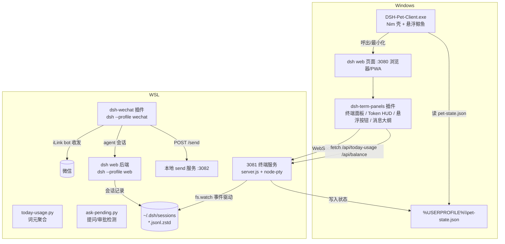

# DSH Pet Client v2.2.2

DeepSeek Harness 的 Windows 桌面客户端——**浏览器化架构**：对话界面走默认浏览器（127.0.0.1:3080），壳层保留悬浮鲸鱼 + 托盘 + Token HUD + 终端面板 + 微信通道。

用 **Nim + winim** 实现的轻量宠物壳（去掉 WebView2 独立窗口——闪退/401/token 交换/窗口重建等壳层问题随窗口一并消除）。

> ⚠️ **重要：本版本要求 dsh web 部署在 WSL 中**（终端服务、词元统计、宠物状态联动均依赖 WSL 侧的配套服务），部署方式见下方「WSL 部署」。
>
> 📌 **dsh 0.1.2-rc.1 起 web 强制浏览器认证**：本版已内置 token 自动引导（exe 同目录 `dsh-web-token.txt`），配合 WSL 侧 `dsh-web-token-sync` 插件可全程免手动，详见「认证引导」。

## 亮点

| 指标 | 数值 |
|---|---|
| exe 体积 | ~360 KB（v2.1.6 为 ~990KB）|
| 内存占用 | ~27 MB |
| 启动 | 秒开（纯 Win32 托盘+宠物）|
| 渲染内核 | 无（界面在默认浏览器中渲染）|

## 功能

- 🖥️ **内嵌终端**：Token HUD 底部「>_ 终端」按钮开合（不再占用悬浮位），直连 WSL 侧 3081 终端服务（真 PTY bash），支持自定义背景色 / 透明度 / 字号 / 字体（含霞鹜文楷等宽、Fira Code 等），面板位置大小记忆、点击浮层外分层收起
- 📊 **Token HUD**：右上角常驻面板（180px），实时显示当日 输入 / 输出 / 命中率 / 花费 / 余额（金额一位小数），数据行对齐、可拖动，字体随界面字体设置
- 🌐 **PWA 对话窗口**：托盘左键 / 鲸鱼单击 = PWA 对话窗口**呼出 ↔ 最小化**（未装 PWA 时回落默认浏览器打开 127.0.0.1:3080）；同时开着浏览器标签时**优先跟随 PWA 窗口**（按窗口有无地址栏区分）
- 🐳 **四色悬浮鲸鱼宠物**：基态跟随对话窗口——**可见 = 蓝**、**收起/最小化 = 黑**；**需要你交互时（提问/审批）= 橙色心跳闪烁**；**回复完成 = 绿色常亮**（对话窗口切到前台即停；托盘图标同步变色）
- 📑 **消息大纲（左缘横杠）**：当前会话我的消息侧边导航——数据源为官方同源 turnOutline 投影（兼容 dsh 0.1.2-rc.1 新架构，全量轮次显示），hover 展开、点击跳转（黄闪）。*已知限制：dsh 0.1.2-rc.1 官方历史分页缺陷导致更深历史暂不可达，待官方修复后自动受益*
- 🗂️ **已归档会话管理**：侧边栏设置按钮上方"已归档会话"面板——查看/打开/恢复/删除会话（删除有确认）
- ✒️ **界面字体设置**：设置页"界面"——系统字体选择；字体存服务端（3081），客户端重启可记住、浏览器与客户端共享；HUD 与终端按钮随界面字体，xterm 终端内容保持独立字体设置。**界面字号改用 dsh 官方设置**（本版移除插件自带的界面字号缩放）
- 💬 **微信通道**（dsh-wechat 插件）：iLink bot 收微信消息 → agent 回复；本地 3082 send 服务主动推送（选股 `--push` 用）
- 🖥️ 托盘图标（左键 = PWA 窗口呼出/最小化；右键 = 菜单：完整/纯净模式切换、宠物、退出）
- 🔒 单实例（重复双击不叠开宠物）；🔑 开机自启（可选）

## 架构


```mermaid
graph TD
    subgraph Windows
        A[DSH-Pet-Client.exe<br/>Nim 壳 + 悬浮鲸鱼]
        A -->|呼出/最小化| B[dsh web 页面 :3080 浏览器/PWA]
        B --> C[dsh-term-panels 插件<br/>终端面板 / Token HUD / 悬浮按钮 / 消息大纲]
        A -->|读 pet-state.json| D[%USERPROFILE%\\pet-state.json]
    end

    subgraph WSL
        E[dsh web 后端<br/>dsh --profile web]
        F[3081 终端服务<br/>server.js + node-pty]
        G[today-usage.py<br/>词元聚合]
        H[ask-pending.py<br/>提问/审批检测]
        I[dsh-wechat 插件<br/>dsh --profile wechat]
        J[本地 send 服务 :3082]
        E -->|会话记录| S[(~/.dsh/sessions<br/>*.jsonl.zstd)]
        F -->|fs.watch 事件驱动| S
        F -->|写入状态| D
        I -->|iLink bot 收发| WX[(微信)]
        I -->|agent 会话| E
        I -->|POST /send| J
    end

    C -->|WebSocket /ws| F
    C -->|fetch /api/today-usage /api/balance| F
```

**数据流**：插件在页面里渲染终端/词元 → 通过 WebSocket 和 HTTP 连 3081 终端服务 → 服务在 WSL 里跑 bash、聚合会话记录 → 宠物状态写入文件，客户端 Nim 读取控制宠物颜色。微信通道由 dsh-wechat 插件（wechat profile 常驻）经 iLink bot 收发消息，本地 3082 send 服务供主动推送（如选股结果）。

## 目录结构

```
DSH-Pet-Client/
├── dsh_client_full.nim   # 客户端主源码（Nim）
├── dsh-term-panels/       # dsh web 前端插件（终端面板/HUD/按钮界面/消息大纲；大纲已合并回内置，2026-09-01 删除独立包）
├── dsh-web-token-sync/    # 认证 token 自动同步插件（dsh web 每次启动把最新 token 写入客户端目录，2026-09-05 新增）
├── dsh-archive-sync/      # 已归档会话「恢复免重启」插件（进程内同步 workspace.json 归档集合，2026-09-10 新增）
├── dsh-wechat/            # 微信通道插件（iLink bot <-> agent + 3082 send 服务）
├── terminal-server/       # 3081 终端服务（node + node-pty + 词元/提问检测；backgrounds/ 终端背景图）
├── deploy.sh              # WSL 一键部署脚本
├── assets/                # 鲸鱼素材（四色 fish_*.bin/.ico + favicon svg）
├── 使用说明.md            # 面向使用者的说明文档（随发布包分发）
└── README.md
```

## WSL 部署（重要）

**前提**：Windows 10/11 + WSL2 + Ubuntu（`wsl --install`）。

**一键部署（在 WSL 内运行）**：

```bash
# 1. 克隆/拷贝本仓库到 WSL，进入目录
bash deploy.sh
```

脚本自动完成：装依赖 → 装 dsh → 配 DeepSeek API Key → 装终端服务 → 装插件 → 配置 systemd 服务自启（dsh-web + 终端服务）→ **自动重启 WSL**。

**部署完成后**：重新打开 WSL（服务已自启），Windows 侧双击 `dsh_client_full.exe` 即可使用——之后日常打开 WSL 就能用，无需再跑脚本。

> 如需手动启动（不重启 WSL）：`dsh --profile web` + `cd terminal-server && nohup node server.js &`

## 编译

依赖 Nim（2.x）+ MinGW-w64 + [winim](https://github.com/khchen/winim)（**v2.2 浏览器化后不再需要 nim-webui**）：

```bat
nim c --app:gui -d:release --path:"<winim路径>" dsh_client_full.nim
```

编译要点：
- `--app:gui`：无终端窗口；先 `taskkill /F /IM dsh_client_full.exe` 再编译
- 蓝屏/异常中断后若报 `file not recognized`：删除 `nimcache/dsh_client_full_r` 重新编译
- 运行时需要 4 个 DLL（libgcc_s_seh-1 / libssp-0 / libstdc++-6 / libwinpthread-1）放 exe 同目录

## 使用说明

| 操作 | 效果 |
|---|---|
| 托盘左键 / 悬浮鲸鱼左键 | PWA 对话窗口 呼出 ↔ 最小化（未装 PWA 则拉起浏览器）|
| 托盘右键 / 悬浮鲸鱼右键 | 菜单（切换：完整模式 / 纯净模式[复制指令] / 显示或隐藏宠物 / 退出）|
| 悬浮鲸鱼右键 | 同托盘菜单 |
| 页面右上角 Token HUD 底部 `>_ 终端` | 打开 / 收起 内嵌终端 |
| 终端面板 `⚙` | 背景色 / 透明度 / 字号 / 字体设置（点击面板内任意处即收起浮层）|
| 左缘横杠 | hover 展开大纲 / 点击跳转定位消息（黄闪 1.6s）|

### 认证引导（dsh 0.1.2-rc.1 起）

dsh web 每次启动生成一次性 token；WSL 侧挂载 `dsh-web-token-sync` 插件后
会自动把最新 token 写入 exe 同目录 `dsh-web-token.txt`，客户端重开即自动认证，
**全程无需手动**。未挂插件时才需手动把 web 启动 URL（`.../?token=xxxx`）写入该文件一次。

### 已归档会话恢复免重启（dsh-archive-sync，2026-09-10 新增）

dsh 官方把会话归档设计成**单向**（`dsh-workspace/README`：*Archiving is one-way … no unarchive action exists yet*），
且归档集合读在内存里 —— 外部修改 `~/.dsh/storages/workspace.json` 必须重启 dsh web 才可见。

本插件在 dsh 进程内轮询该文件，发现归档集合与内存不一致时调用 `workspaceRegistry.setState` 同步
（持久化与前端推送由 dsh 自己完成）→ **恢复会话瞬间生效、无需重启**。

接线（web profile，装一次即可）：

```bash
cd ~/.dsh/profiles/web
# ① package.json：dependencies 加 "dsh-archive-sync": "link:<仓库路径>/dsh-archive-sync"
#                 dsh.profile.bundles 加 "dsh-archive-sync"
# ② 建链接（或直接 pnpm install）
ln -s <仓库路径>/dsh-archive-sync node_modules/dsh-archive-sync
# ③ 加载一次，此后不再需要重启
sudo systemctl restart dsh-web
```

未装该插件时也能恢复（3081 会写回 workspace.json），只是要等一次 dsh web 重启才可见。
若 dsh 升级后日志出现 `[dsh-archive-sync] workspaceRegistry API 不可用`，说明内部方法改名、需按新版适配
（插件只记日志，不会影响 dsh 本体）。

## 版本历史

| 版本 | 内容 |
|---|---|
| v2.2.2（当前）| **宠物动画调整**：悬浮鲸鱼绕圈轨道半径由 120px **改小为 40px**（原圈太大显得晃眼、完全静止又太呆），保留吐泡泡、鼠标靠近游向鼠标、拖动等其余动画。**dsh 0.1.7 适配**：① **会话日志 v4**（`session.v4.jsonl.zstd`，terminal-server/ask-pending.py/today-usage.py 候选名 v4 优先，v4 为完整文件非增量）；② **已归档会话删除/恢复修复**（`SESSION_ID_RE` 原要求 `session-` 前缀，而归档集合存的是纯 UUID → 全部 400「删除失败」；改正则前缀可选 + `findSessionDir` 双命名查找 + 孤儿归档项幂等删除）；③ **已归档面板适配新侧边栏**（0.1.7 起设置条目不再是 `<button>` → 锚点放宽到任意标签 + 文本匹配，定位改为相对设置条目的坐标定位、宽度对齐）；④ **favicon 深色变体**（`favicon-dark.svg` 一并替换为黑鲸）；⑤ `post-dsh-upgrade.sh --fix` 对齐 wechat profile 依赖（291 包 + mnemon 全家）。说明文档全部 `.md`。**（曾试做「启动自唤醒 WSL」，实测判定鸡肋——唤醒与 `wsl-autostart.vbs` 重复、等待期用户一点开即失效，已整段移除；WSL 与三服务继续由自启项 + systemd 负责）** |
| v2.2.1 | **归档会话删除即时生效**（不用重启 dsh web）：3081 删除会话时写「挂起清单」`~/.dsh/storages/dsh-pending-deletes.json` 并清投影缓存，新增 `GET /api/session-pending-deletes`；前端已归档面板启动时拉取该清单做永久过滤，刷新页面后已删会话不再「复活」；`dsh-archive-sync` 在 dsh 启动时结算墓碑/孤儿归档项。**移除页面缩放浮标**（浏览器自带缩放已足够：删 `buildZoomHud` 及 Ctrl+滚轮 / `+` / `-` / `0` 监听，README 功能列表与快捷键表同步）。均为前端/3081/插件改动——**刷新页面即生效，exe 无需重编译** |
| v2.2.0 | **浏览器化架构**：去掉 WebView2 独立窗口，对话界面走浏览器/PWA（127.0.0.1:3080）——闪退/401/token 交换/窗口重建/导航刷新等壳层问题随窗口消除；exe 瘦身 ~360KB（删 webui 窗口/token 交换/L 手势监控/尺寸记忆/窗口置前回执/页内鼠标手势）+ **黑鲸图标统一**（PWA favicon 与 exe/托盘同素材）；**鲸鱼四色**：基态跟随对话窗口（可见=蓝 / 收起=黑）、提问审批=橙心跳、回复完成=绿常亮（窗口置前即停）；同标题多窗口时**优先跟随 PWA**（按有无地址栏区分）；启动自动拉起 PWA、单实例互斥、托盘退出一并关窗；**适配 dsh 0.1.5-rc.1**：会话日志改名 session.v3.jsonl.zstd（terminal-server 与 ask-pending.py 同时认新旧名，否则橙/绿信号失效）；**界面字号交回官方设置**（移除插件自带缩放，保留界面字体选择）；纯净/完整切换保留托盘「复制指令」兜底；保留窗口版走 v2.1.x 线 |
| v2.1.6 | 纯净 dsh 模式（托盘「打开 DSH（纯净模式）」一键切换，--patch 剥离第三方插件仅保留官方 base+web-app + token-sync；网页/客户端原版样、鲸鱼仍在、第三方元素全无；插件崩时不用备份/恢复 ~/.dsh）+ 托盘两入口改名（完整版/纯净模式）点击复制切换指令到剪贴板 + 401 根治（waitTokenStable 轮询等服务端新 token 稳定再导航；dsh-mode.sh 改 stop→等端口释放→start 避免多重启）+ HUD 字号 13px + dsh-term-panels 持久化修复（_serverSettingsCache 缓存/设置面板 UI 同步/页面缩放外接）+ dsh-web-token-sync 补 dsh.bundle 声明 + dsh-message-outline 弃用删除 |
| v2.1.5 | 适配 dsh 0.1.2-rc.1：① web 强制认证（客户端 token 自动引导 + dsh-web-token-sync 插件自动同步 + 托盘「浏览器打开原版」后备入口）；② 左缘大纲改官方同源 turnOutline 投影数据（新架构兼容，全量显示；官方历史分页缺陷待修）；③ 终端入口收进 Token HUD 底部按钮；④ HUD 180px/数据对齐/金额一位小数/字体跟随设置；⑤ 界面字号字体存服务端（跨重启记忆、浏览器/客户端共享）；⑥ 终端字体库扩充（霞鹜文楷等宽/Fira Code）并独立于界面字体 |
| v2.1.4 | L 手势最小化（右键下→右 ±30°，事件驱动零延迟）；回复完成绿色常亮（不闪）；已归档会话面板（打开/恢复/删除）；界面字体设置（系统字库选择 + 字号下拉）；消息大纲随侧边栏宽度实时定位；exe 蓝色鲸鱼图标；微信 bot 修复（dsh 0.1.1-rc.2 会话持久化冲突导致不回消息） |
| v2.1.3 | 回复完成绿闪提示（提问后 dsh 干完活，悬浮鲸鱼/托盘/任务栏图标绿↔基态闪烁，主窗口置前即停）；基态色交换（打开=蓝、最小化=黑）；重启 dsh-web 后内嵌页面自动刷新（后端恢复检测 → navigate）；dsh-web.service 加 --no-open（不再自动弹系统浏览器）；Hub 平台 token 自动获取（从浏览器本地存储读取，token 失效自动恢复，无需手动 F12） |
| v2.1.2 | Bug 修复：①dsh 一键更新后仍显示旧版本（根因=server.js 用 require() 读 package.json 触发 Node 模块缓存，dsh-terminal 进程永远读到首次加载版本）→ 改 readLocalDshVersion() 用 fs.readFileSync+JSON.parse；②余额一直不显示（根因=.credentials.yaml 的 DEEPSEEK_API_KEY 在 refs: 嵌套下带缩进，正则 ^ 匹配不上）→ 改 ^\s*；余额刷新频率 2 分钟→30s（HUB 词元保持 10s 拉取/60s 聚合不变）；手动 sudo 重启 dsh-web 后前端轮询 /api/dsh-version 至 hasUpdate=false 且 3080 可访问时自动刷新页面（6 分钟超时） |
| v2.1.1 | Token HUD 增强：余额<5 元红色警示、「花费」行高峰/空闲状态（DeepSeek 峰谷定价官方规则 9:00-12:00/14:00-18:00，UTC+8）；dsh 版本更新提示（右下角一键更新，自动升级 npm 包 + 打开终端预输入 sudo 重启）；终端面板毛玻璃对齐 Token HUD；消息大纲拆分为独立 npm 插件 dsh-message-outline（v0.1.1 已上架） |
| v2.1.0 | 消息大纲独立插件（dsh-message-outline）、微信通道插件（dsh-wechat + 3082 send 服务）、微信会话归档隐藏；横杠大纲定稿（收起=视口 10 条窗口、行边界吸附）；README 整理 |
| v2.0.3 | 横杠大纲交互定稿：收起/展开对齐、激活消息蓝条跟随、鼠标手势（上/下/刷新）、缩放浮标 |
| v2.0.2 | 点✕=最小化（退出走托盘）、任务栏图标同步宠物色交替闪烁 |
| v2.0.1 | 图片背景、交替闪烁、终端状态服务端持久化 |
| v2.0.0 | 内嵌终端 + Token HUD + 三色宠物 + WSL 一键部署 |
| v1.0.0（GitHub Release）| 托盘 + 悬浮鲸鱼宠物 + 自动重建（闪退修复 v15）|

## 踩过的坑（给贡献者）

> ⚠️ 第 1–2 条与第 6 条属 **v2.1.x 窗口版（WebView2）** 的历史经验，v2.2 浏览器化后已不适用，仅作备查。

1. **窗口 15 秒自动关闭**：外部页面无 webui.js 连接 → 超时判"未连接"关窗，**必须 `setTimeout(0)`**。
2. **窗口异常消失/闪退**：对 webui 窗口的任何挂钩都会干扰初始化，**保持无挂钩** + 轮询重建。
3. **Nim `not` 是位取反**：`not IsWindowVisible(wnd)` 恒 true，**必须写 `== 0`**。
4. **窗口查找**：`FindWindowW` 偶发失配 → **EnumWindows + 进程过滤**。
5. **UTF-16 乱码**：托盘/菜单用 MultiByteToWideChar。
6. **内嵌终端不能用 iframe**：WebView2 iframe 透明背景不透出父页面；xterm 须用 **DOM 渲染器**（canvas 渲染器背景清不掉）。
7. **Nim 主循环禁 HTTP**：net 模块 send/recv 在 Windows 触发 0xc0000005 崩溃 → 状态用**本地文件**通信。
8. **前端事件通道是坑**：`subscribeEnvelopes` 是诊断通道收不到业务事件 → 词元/提问检测全部**后端聚合会话记录**。
9. **提问检测三坑**：`tool/result` 无工具名（按 callId 配对）；精确匹配 `"name":"ask_user_question"`（宽匹配误报）；dsh 重试机制（answer 集合 + 10 分钟时间窗）。

## 素材版权

悬浮鲸鱼与图标为 **DeepSeek 品牌形象**的二次创作（蓝/黑/橙三色，泡泡、白色肚皮等个性化改动），版权归 **DeepSeek** 所有，仅供个人学习使用。如 DeepSeek 官方要求，将立即移除相关素材。

## 许可证

[MIT](LICENSE) —— 代码部分。

> 注意：本仓库仅包含客户端代码、前端插件与终端服务，不包含 DeepSeek Harness 本体（后端由官方 `@deepseek-ai/dsh` 提供）。
